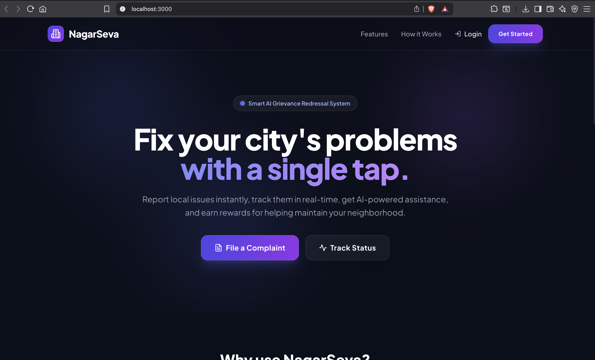
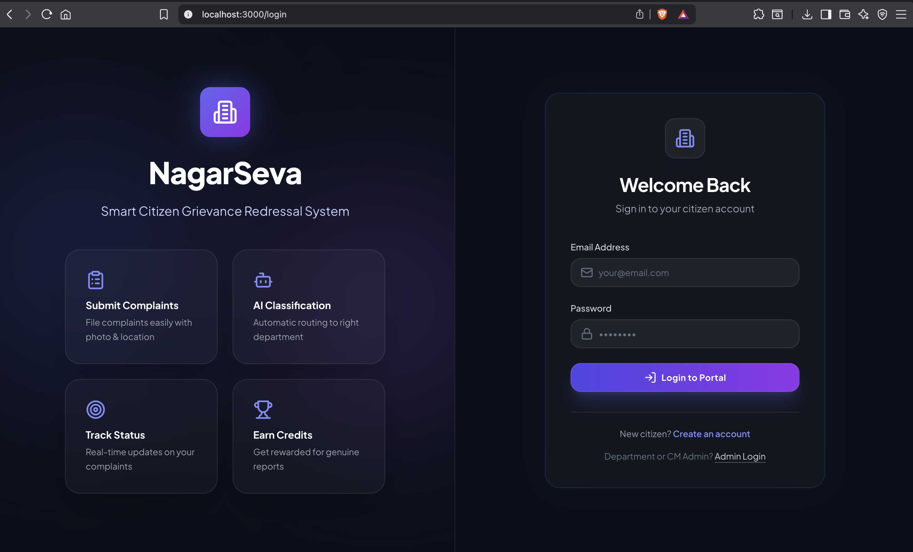
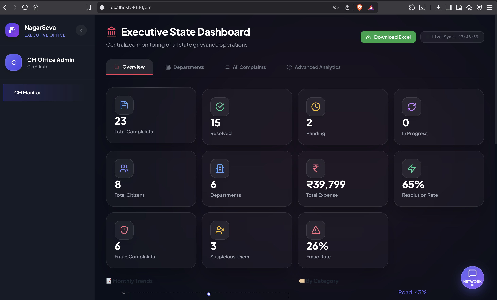

# 🏛️ NagarSeva — AI-Powered Smart Citizen Grievance Redressal System

A full-stack production-ready web application for managing citizen grievances with AI classification, multi-role dashboards, and reward systems.

---

## 🚀 Tech Stack

| Layer | Technology |
|---|---|
| Frontend | React.js 18 + Tailwind CSS + Recharts + Leaflet |
| Backend | Node.js + Express.js + JWT Auth |
| Database | MongoDB Atlas (Mongoose ODM) |
| AI Service | Python FastAPI (keyword NLP classifier) |
| Email | Nodemailer (Gmail SMTP) |

---

## 👥 User Roles

| Role | Access |
|---|---|
| **Citizen** | Submit/track complaints, earn credits |
| **Department Admin** | View/assign complaints, update status |
| **Worker** | View assigned tasks, update progress |
| **CM Admin** | Full analytics, all departments, expenses |

---

## 📁 Folder Structure

```
grievance-system/
├── backend/
│   ├── controllers/
│   │   ├── authController.js
│   │   ├── complaintController.js
│   │   ├── departmentController.js
│   │   ├── cmController.js
│   │   └── userController.js
│   ├── middleware/
│   │   ├── auth.js          # JWT + Role-based middleware
│   │   └── upload.js        # Multer file upload
│   ├── models/
│   │   ├── User.js
│   │   ├── Complaint.js
│   │   ├── Department.js
│   │   └── OTP.js
│   ├── routes/
│   │   ├── auth.js
│   │   ├── complaints.js
│   │   ├── departments.js
│   │   ├── workers.js
│   │   ├── cm.js
│   │   └── users.js
│   ├── utils/
│   │   ├── email.js         # Nodemailer email templates
│   │   └── seeder.js        # Database seed script
│   ├── uploads/             # Auto-created for image storage
│   ├── server.js
│   ├── package.json
│   └── .env.example
│
├── frontend/
│   ├── public/
│   │   └── index.html
│   ├── src/
│   │   ├── components/
│   │   │   └── shared/
│   │   │       ├── Sidebar.js
│   │   │       ├── ComplaintCard.js
│   │   │       └── StatCard.js
│   │   ├── context/
│   │   │   └── AuthContext.js
│   │   ├── pages/
│   │   │   ├── LoginPage.js
│   │   │   ├── RegisterPage.js
│   │   │   ├── AdminLoginPage.js
│   │   │   ├── CitizenDashboard.js
│   │   │   ├── SubmitComplaint.js
│   │   │   ├── TrackComplaint.js
│   │   │   ├── CreditsPage.js
│   │   │   ├── DepartmentDashboard.js
│   │   │   ├── WorkerDashboard.js
│   │   │   ├── CMDashboard.js
│   │   │   └── NotFound.js
│   │   ├── utils/
│   │   │   ├── api.js       # Axios instance + interceptors
│   │   │   └── helpers.js   # Formatters, constants
│   │   ├── App.js
│   │   ├── index.js
│   │   └── index.css        # Tailwind + custom styles
│   ├── package.json
│   ├── tailwind.config.js
│   └── .env.example
│
└── ai-service/
    ├── main.py              # FastAPI NLP classifier
    └── requirements.txt
```

---

## 📸 Screenshots

| Lending Page | Login Page | CM Deshboard |
|:-----------:|:------------:|:---------------:| 
|  |  |  |

---


## ⚙️ Setup Instructions

### Prerequisites
- Node.js >= 18
- Python >= 3.9
- MongoDB Atlas account (or local MongoDB)
- Gmail account (for email OTPs)

---

### 1. Clone / Extract the Project

```bash
cd grievance-system
```

---

### 2. Setup Backend

```bash
cd backend
npm install
```

Create `.env` file (copy from `.env.example`):

```env
PORT=5000
MONGODB_URI=mongodb+srv://<username>:<password>@cluster0.xxxxx.mongodb.net/grievance_db
JWT_SECRET=your_super_secret_key_min_32_chars
JWT_EXPIRE=7d

EMAIL_HOST=smtp.gmail.com
EMAIL_PORT=587
EMAIL_USER=your_gmail@gmail.com
EMAIL_PASS=your_gmail_app_password   # Use App Password, not Gmail password

AI_SERVICE_URL=http://localhost:8000
FRONTEND_URL=http://localhost:3000
MAX_FILE_SIZE=5242880
UPLOAD_PATH=./uploads
```

**Gmail App Password**: Go to Google Account → Security → 2-Step Verification → App Passwords → Generate for "Mail".

**Seed demo data:**
```bash
npm run seed
```

**Start backend:**
```bash
npm run dev     # Development (nodemon)
npm start       # Production
```

Backend runs on **http://localhost:5000**

---

### 3. Setup AI Service

```bash
cd ai-service
pip install -r requirements.txt
python main.py
```

AI service runs on **http://localhost:8000**

Test it:
```bash
curl -X POST http://localhost:8000/predict \
  -H "Content-Type: application/json" \
  -d '{"text": "There is a deep pothole on MG Road causing accidents"}'
```

---

### 4. Setup Frontend

```bash
cd frontend
npm install
```

Create `.env` file:
```env
REACT_APP_API_URL=http://localhost:5000/api
REACT_APP_UPLOAD_URL=http://localhost:5000
```

**Start frontend:**
```bash
npm start
```

Frontend runs on **http://localhost:3000**

---

## 🔑 Demo Login Credentials (after seeding)

| Role | Email | Password / Method |
|---|---|---|
| CM Admin | cm@grievance.gov.in | Admin@123 |
| Dept Admin (Roads) | admin.road@grievance.gov.in | Admin@123 |
| Dept Admin (Sanitation) | admin.san@grievance.gov.in | Admin@123 |
| Worker | worker1@grievance.gov.in | Admin@123 |
| Citizen | citizen1@example.com | OTP via email |

> **Note**: Admin/Worker login uses email+password at `/admin-login`. Citizens use OTP at `/login`.
> 
> For citizens without a real email setup, you can use the `/api/auth/send-otp` endpoint and check the server console — OTP is logged in development.

---

## 🌐 API Endpoints

### Auth
| Method | Endpoint | Description |
|---|---|---|
| POST | `/api/auth/send-otp` | Send OTP to email |
| POST | `/api/auth/register` | Register citizen |
| POST | `/api/auth/login` | Login with OTP |
| POST | `/api/auth/admin-login` | Admin login with password |
| GET | `/api/auth/me` | Get current user |

### Complaints
| Method | Endpoint | Description |
|---|---|---|
| GET | `/api/complaints` | List complaints (role-filtered) |
| POST | `/api/complaints` | Submit complaint (multipart/form-data) |
| GET | `/api/complaints/:id` | Get single complaint |
| PUT | `/api/complaints/:id` | Update complaint |
| GET | `/api/complaints/stats` | Citizen stats |

### Departments
| Method | Endpoint | Description |
|---|---|---|
| GET | `/api/departments` | All departments |
| POST | `/api/departments` | Create department (CM admin) |
| GET | `/api/departments/:id/analytics` | Department analytics |
| GET | `/api/departments/:id/workers` | Department workers |

### CM Dashboard
| Method | Endpoint | Description |
|---|---|---|
| GET | `/api/cm/stats` | Global stats |
| GET | `/api/cm/department-performance` | All dept performance |
| GET | `/api/cm/category-distribution` | Complaints by category |
| GET | `/api/cm/monthly-trends` | 6-month trends |
| GET | `/api/cm/complaints` | All complaints |
| GET | `/api/cm/expense-report` | Expense summary |

### Workers
| Method | Endpoint | Description |
|---|---|---|
| GET | `/api/workers/tasks` | My assigned tasks |
| PUT | `/api/workers/tasks/:id` | Update task status |

### Users
| Method | Endpoint | Description |
|---|---|---|
| GET | `/api/users/profile` | Get profile |
| PUT | `/api/users/profile` | Update profile |
| GET | `/api/users/credits` | Credit history |
| POST | `/api/users/claim-reward` | Claim reward |
| POST | `/api/users` | Create user (admin) |

---

## 🤖 AI Service API

| Method | Endpoint | Description |
|---|---|---|
| POST | `/predict` | Classify complaint text |
| POST | `/predict-with-image` | Classify with image + text |
| GET | `/categories` | Available categories |
| GET | `/health` | Health check |

**Request:**
```json
{ "text": "There is a broken water pipe flooding the street" }
```

**Response:**
```json
{
  "category": "water",
  "priority": "high",
  "confidence": 0.85,
  "department_suggestion": "Water Supply"
}
```

---

## 🧩 Features Summary

- ✅ Email OTP registration/login (5-minute expiry)
- ✅ JWT authentication with role-based access control
- ✅ AI complaint classification (NLP keyword + priority scoring)
- ✅ Image upload for complaints and proof of resolution
- ✅ Auto GPS location detection
- ✅ Email notifications on submit & resolve (HTML templates)
- ✅ Multi-role dashboards (Citizen, Dept Admin, Worker, CM)
- ✅ Credit & reward system (10 pts/complaint, ₹100 per 100 credits)
- ✅ Recharts analytics (Line, Bar, Pie, Radar charts)
- ✅ Department performance scoring & slow-department alerts
- ✅ Expense tracking per complaint and department
- ✅ Auto complaint number generation (GRV-000001)
- ✅ Responsive design with Tailwind CSS

---

## 🚢 Production Deployment Notes

1. **Backend**: Deploy to Railway, Render, or EC2. Set all env vars.
2. **Frontend**: Build with `npm run build`, deploy to Vercel/Netlify.
3. **AI Service**: Deploy to Railway or a Python-compatible host.
4. **MongoDB**: Use MongoDB Atlas free tier.
5. **Email**: Use Gmail App Password or switch to SendGrid for scale.
6. **File Storage**: Replace local `uploads/` with AWS S3 or Cloudinary in production.

---

## 📄 License

MIT — Free to use for educational and government projects.
